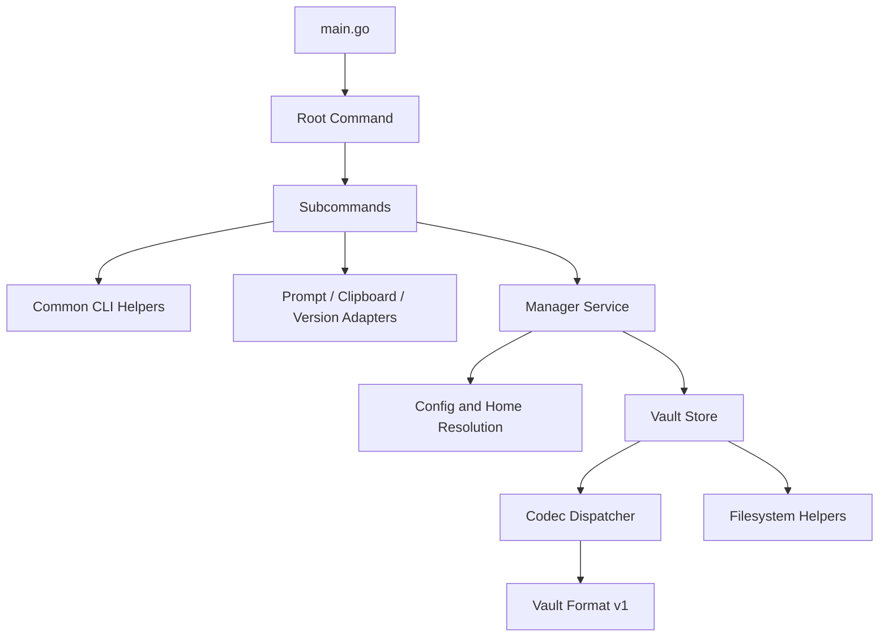
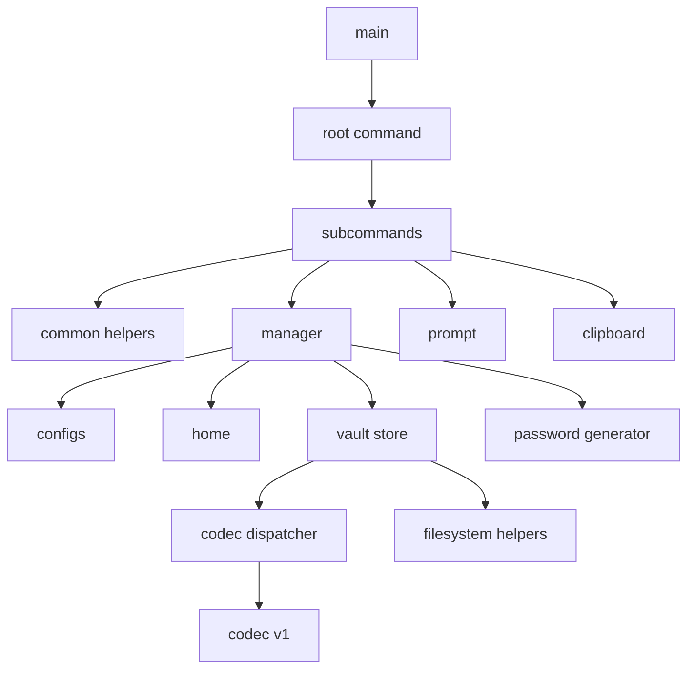
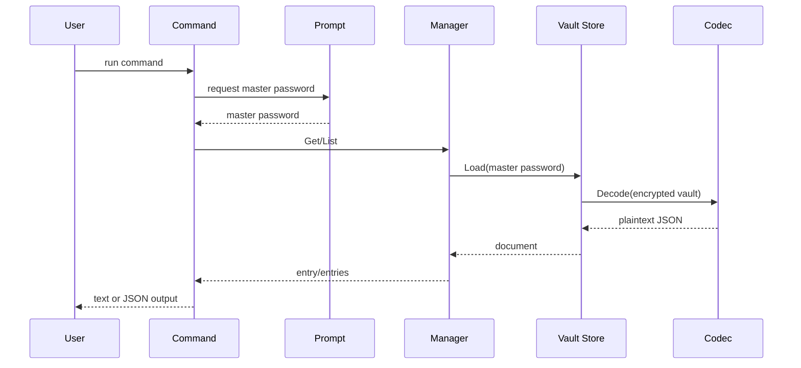
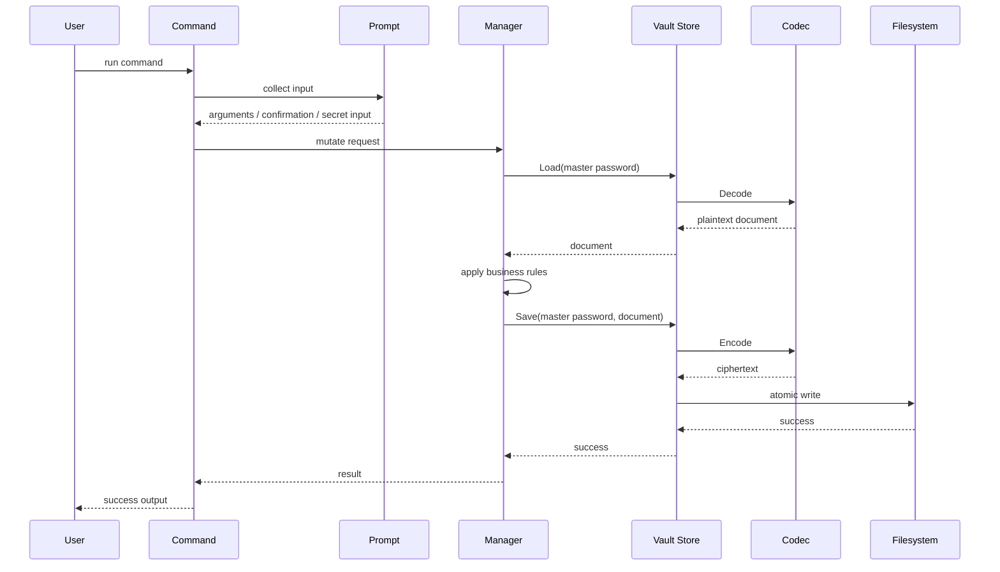

# keepass 1.0.0 Architecture

## Scope

This document focuses on the structural design of the `keepass` 1.0.0 codebase:

- runtime layering
- component responsibilities
- request flow
- command execution model
- environment and path resolution

For storage and security details, see [storage-security-v1.0.0.md](./storage-security-v1.0.0.md).

For command behavior and output contracts, see [cli-spec-v1.0.0.md](./cli-spec-v1.0.0.md).

## 1. Architectural Style

The 1.0.0 codebase uses a small layered CLI architecture.

The design intentionally avoids:

- background services
- RPC
- plugin systems
- databases
- external coordinators

This keeps the runtime model easy to reason about and test.

## 2. Module Layout

### 2.1 Entry Point

- `main.go`
  - program entrypoint
  - delegates to the root command package

### 2.2 CLI Command Layer

- `cmd/cmder/root`
  - root command construction
  - global flags
  - version reporting
  - top-level command registration
- `cmd/cmder/add`
- `cmd/cmder/get`
- `cmd/cmder/list`
- `cmd/cmder/update`
- `cmd/cmder/delete`
- `cmd/cmder/rehash`
- `cmd/cmder/init`
- `cmd/cmder/config`
- `cmd/cmder/completion`

The command layer owns user-facing flow, but avoids business-heavy logic.

### 2.3 Common CLI Utilities

- `cmd/cmder/common`
  - prompt wiring
  - JSON/text rendering
  - interactive-mode detection
  - error-to-exit-code mapping

### 2.4 Service Layer

- `internal/manager`
  - entry CRUD orchestration
  - alias normalization
  - tag normalization
  - unique-prefix lookup
  - list filtering
  - generated password fallback

This layer is the main behavioral core of the application.

### 2.5 Persistence and Crypto

- `configs`
  - defaults
  - validation
  - config read/write
- `internal/vault`
  - vault document model
  - encrypted load/save
  - format version dispatch
  - codec implementation
- `pkg/files`
  - directory creation
  - atomic file writes

### 2.6 Environment and Interaction Adapters

- `internal/home`
  - runtime path detection
- `internal/prompt`
  - prompt and secret input behavior
- `internal/password`
  - random password generation
- `internal/clipboard`
  - clipboard integration and timed clearing
- `internal/version`
  - version/build metadata rendering

## 3. Dependency Flow

Key dependency rule:

- commands depend inward on services and helpers
- services do not depend on command packages

This keeps the domain logic testable without shell-specific behavior.

## 4. Responsibility Boundaries

### 4.1 What the Command Layer Does

The command layer should:

- define flags and positional arguments
- choose interactive vs non-interactive behavior
- request master password input
- print text or JSON output
- map domain errors to stable exit codes

It should not:

- implement alias matching rules
- implement vault cryptography
- directly manipulate encrypted files

### 4.2 What the Manager Layer Does

The manager layer should:

- load and save vault documents through the store
- enforce alias and tag rules
- maintain consistent sorting
- handle generated passwords
- maintain timestamp updates

It should not:

- prompt the user
- print output
- choose exit codes

### 4.3 What the Vault Layer Does

The vault layer should:

- define the on-disk encrypted persistence boundary
- decode and encode the vault file
- validate format headers
- reject unsupported versions
- persist atomically with strict file permissions

It should not:

- know about CLI prompts
- know about list filtering semantics
- know about shell output format

## 5. Runtime Path Resolution

The runtime environment is resolved as follows:

1. if `KEEPASS_HOME` is set, use it as the root
2. otherwise use `<user-home>/.keepass`

Derived paths:

- config file: `<root>/keepass.config.json`
- default vault file: `<root>/keepass.kp`

This design enables:

- user-default local operation
- test isolation through environment override
- CI-safe temporary home directories

## 6. Main Request Flows

### 6.1 Read Flow

Representative commands:

- `get`
- `list`

Flow:

### 6.2 Write Flow

Representative commands:

- `init`
- `add`
- `update`
- `delete`
- `rehash`

Flow:

## 7. Interaction Model

There are two execution modes:

- interactive
- non-interactive

Interactive mode is selected when stdin is a TTY and `--non-interactive` is not set.

Non-interactive mode is used for:

- scripts
- CI
- redirected stdin

Design rationale:

- avoid blocking automation on hidden prompts
- keep local UX concise and human-friendly

## 8. Output Model

The command layer exposes two primary output styles:

- text output for terminals
- JSON output for automation

The output design is intentionally handled above the service layer so that:

- domain logic stays UI-agnostic
- tests can focus separately on behavior and formatting

## 9. Build and Release Interaction with Architecture

Build metadata is injected at build time and surfaced by the root command.

This creates a clean split:

- source tree owns the rendering contract
- CI/release pipelines own the concrete values

As a result:

- local builds report `dev`
- release builds report tag + commit + build time

## 10. Testability Strategy

The architecture is designed for straightforward testing:

- service rules are tested without shell parsing
- vault codecs are tested directly
- command packages are integration-tested through `cobra`
- exit-code behavior is tested by running the built binary
- `KEEPASS_HOME` enables isolated filesystem state per test

## 11. Architectural Constraints

The 1.0.0 architecture intentionally optimizes for:

- simplicity
- local operation
- auditable control flow
- small dependency surface

It intentionally does not optimize for:

- horizontal scaling
- remote coordination
- plugin extensibility
- daemonized operation

## 12. Summary

The 1.0.0 architecture is a deliberate small-system design:

- commands stay thin
- domain rules live in the manager layer
- encrypted persistence is isolated in the vault layer
- environment and output concerns are handled at the edge

This is the right shape for a local-first password manager CLI at 1.0.0 scale.
