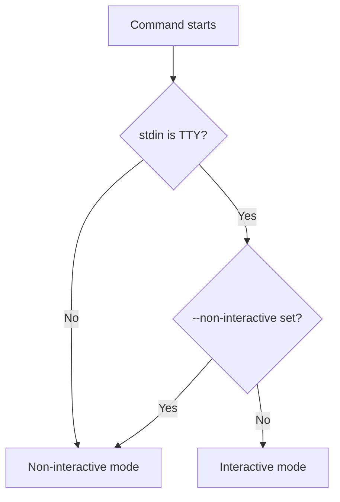
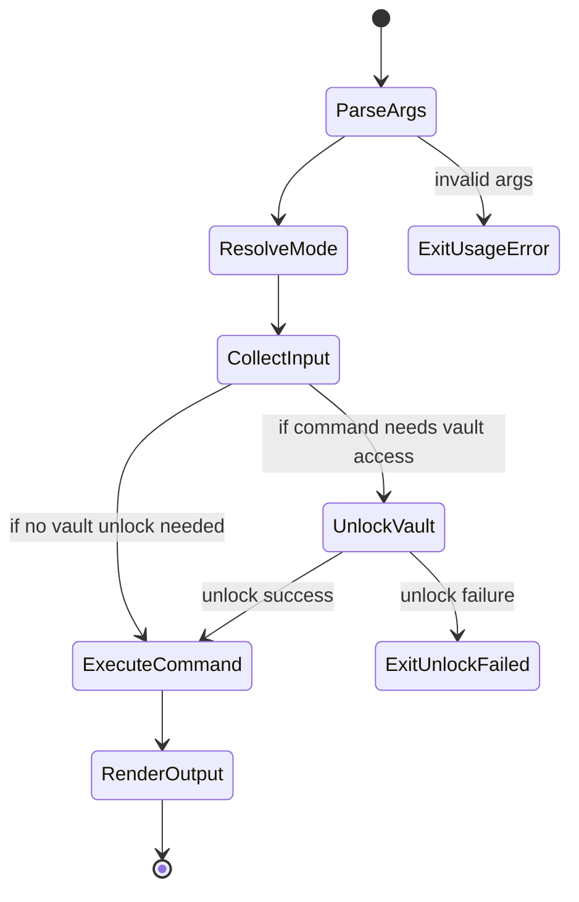
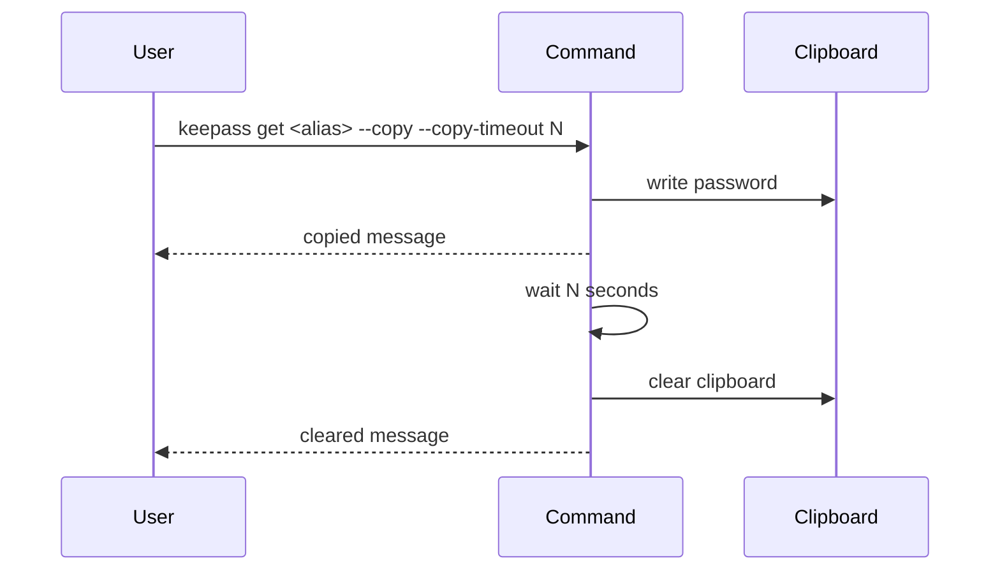

# keepass 1.0.0 CLI Specification

## Scope

This document defines the user-facing CLI behavior of `keepass` 1.0.0:

- command set
- input rules
- interaction patterns
- output modes
- lookup semantics
- exit code behavior

For implementation structure, see [architecture-v1.0.0.md](./architecture-v1.0.0.md).

For vault and security design, see [storage-security-v1.0.0.md](./storage-security-v1.0.0.md).

## 1. Root Command

Root binary name:

- `keepass`

Aliases:

- `kee`
- `kps`

Global behavior:

- supports `--version`
- supports inherited `--non-interactive`
- uses stable exit codes for key failure classes

## 2. Interaction Modes

The CLI operates in two modes:

- interactive
- non-interactive

Selection logic:

- if stdin is a TTY and `--non-interactive` is not set, use interactive mode
- otherwise behave as non-interactive

Design intent:

- interactive mode optimizes for convenience
- non-interactive mode optimizes for safe automation

### 2.1 Mode Selection Model

## 3. Command Inventory

The 1.0.0 line includes:

- `init`
- `add`
- `list`
- `get`
- `update`
- `delete`
- `audit`
- `rotate`
- `export`
- `import`
- `backup`
- `restore`
- `doctor`
- `rehash`
- `config`
- `completion`

Password generation policy is configured through:

- `password_generator.preset`
- optional `password_generator.alphabet` override

## 4. Command Contract Matrix

| Command | Positional args | Reads vault | Writes vault | Requires master password | JSON output | Interactive prompts |
| --- | --- | --- | --- | --- | --- | --- |
| `init` | none | No | Yes | Yes | No | Yes |
| `add` | `[alias] [username]` | Yes | Yes | Yes | No | Yes |
| `list` | `[query]` | Yes | No | Yes | Yes | Minimal |
| `get` | `<alias>` | Yes | No | Yes | Yes | Minimal |
| `update` | `<alias>` | Yes | Yes | Yes | No | Yes |
| `delete` | `<alias>` | Yes | Yes | Yes | No | Yes |
| `audit` | none | Yes | No | Yes | Yes | Minimal |
| `rotate` | `<alias>` | Yes | Yes | Yes | No | Minimal |
| `export` | none | Yes | No | Yes | No | Minimal |
| `import` | none | Yes | Yes | Yes | No | Minimal |
| `backup` | none | No | No | No | No | No |
| `restore` | none | No | Yes | No | No | No |
| `doctor` | none | No | No | No | Yes | No |
| `rehash` | none | Yes | Yes | Yes | No | Minimal |
| `config` | none | No | No | No | Yes | No |
| `completion` | `<shell>` | No | No | No | No | No |

## 5. Command Semantics

### 5.0 Generic Command Lifecycle

Most commands in the 1.0.0 line follow this lifecycle:

### 5.1 `init`

Purpose:

- initialize the encrypted vault

Behavior:

- loads or creates config
- prompts for a new master password and confirmation
- creates a new encrypted empty vault
- fails if the vault exists unless `--force` is used

Flags:

- `--force`

### 5.2 `add`

Usage:

- `keepass add [alias] [username]`

Behavior:

- accepts alias and username from args when provided
- prompts for missing alias and username only in interactive mode
- optional fields can be supplied by flags or prompted interactively
- manual password entry requires confirmation
- blank account password results in generation
- generated password is hidden by default after creation

Flags:

- `--uri`
- `--note`
- `--tag`
- `--generate`
- `--reveal-generated`

Non-interactive rule:

- alias is required
- username is required

### 5.3 `list`

Usage:

- `keepass list [query]`

Behavior:

- unlocks the vault
- optionally filters by search query
- optionally filters by repeated tags
- returns text table or JSON

Flags:

- `--tag`
- `--json`

Filtering model:

- tag filters are all-match
- query matches alias prefix first, then other fields by case-insensitive substring semantics

### 5.4 `get`

Usage:

- `keepass get <alias>`

Behavior:

- unlocks the vault
- resolves alias by exact match or unique prefix
- hides password by default
- can reveal plaintext explicitly
- can copy plaintext to clipboard

Flags:

- `--reveal`
- `--json`
- `--copy`
- `--copy-timeout`

Clipboard behavior:

- `--copy --copy-timeout 0`
  - copy and return immediately
- `--copy --copy-timeout N`
  - copy, keep process alive for `N` seconds, then clear clipboard

Clipboard timing model:

### 5.5 `update`

Usage:

- `keepass update <alias>`

Behavior:

- unlocks the vault
- resolves the target entry before mutation
- prompts with existing values as defaults
- allows selective replacement of fields
- allows tag replacement or full tag clearing
- allows password action selection

Flags:

- `--username`
- `--uri`
- `--note`
- `--password`
- `--tag`
- `--clear-tags`
- `--clear-uri`
- `--clear-note`
- `--generate`

Password update model:

- leave blank to keep existing password
- choose manual replacement explicitly
- choose generated replacement explicitly
- in non-interactive mode, at least one explicit mutation flag is required

### 5.6 `delete`

Usage:

- `keepass delete <alias>`

Behavior:

- unlocks the vault
- resolves entry before deletion
- confirms deletion unless `--yes` is set
- fails fast in non-interactive mode unless `--yes` is provided

Flags:

- `--yes`

### 5.7 `audit`

Usage:

- `keepass audit`

Behavior:

- unlocks the vault
- analyzes stale passwords, duplicate passwords, and missing metadata
- supports JSON output for automation

Flags:

- `--max-password-age-days`
- `--json`

### 5.8 `rotate`

Usage:

- `keepass rotate <alias>`

Behavior:

- unlocks the vault
- rotates the password for the target alias
- supports generated rotation and manual rotation
- avoids printing the new password unless `--reveal` or `--copy` is requested

Flags:

- `--generate`
- `--password`
- `--reveal`
- `--copy`
- `--copy-timeout`

### 5.9 `export`

Usage:

- `keepass export --path <file>`

Behavior:

- unlocks the vault
- writes a versioned JSON transfer document containing logical entry data

### 5.10 `import`

Usage:

- `keepass import --path <file>`

Behavior:

- unlocks the vault
- imports entry data from a versioned JSON transfer document
- requires explicit conflict strategy through `--conflict`

### 5.11 `backup`

Usage:

- `keepass backup --path <directory>`

Behavior:

- creates a local backup bundle containing encrypted vault, config, and manifest metadata

### 5.12 `restore`

Usage:

- `keepass restore --path <directory>`

Behavior:

- restores config and vault files from a backup bundle
- requires `--force` when target state already exists

### 5.13 `doctor`

Usage:

- `keepass doctor`

Behavior:

- inspects config presence and resolved paths
- inspects vault metadata without requiring the master password
- reports whether current config and stored vault KDF settings are aligned
- supports JSON output for automation

Flags:

- `--json`

### 5.14 `rehash`

Usage:

- `keepass rehash`

Behavior:

- unlocks the vault with the current master password
- rewrites the vault using the current configured Argon2 settings
- preserves existing entries and the master password
- is intended for upgrading cost parameters after config changes

### 5.15 `config`

Usage:

- `keepass config`

Behavior:

- reports effective runtime config and resolved paths
- does not unlock the vault
- if config does not exist, reports defaults with `initialized=false`

Flags:

- `--json`

### 5.16 `completion`

Usage:

- `keepass completion <bash|zsh|fish|powershell>`

Behavior:

- emits completion script to stdout
- does not depend on vault or config state

## 6. Alias Resolution Rules

Lookup order:

1. exact alias match
2. unique prefix match
3. ambiguous prefix failure

Examples:

- `github` resolves `github`
- `gith` resolves `github` only if unique
- `gi` fails if both `github` and `gitea` exist

This rule applies to commands that target a single alias, such as:

- `get`
- `update`
- `delete`

## 7. Normalization Rules

### 7.1 Alias Rules

Aliases are:

- trimmed
- lowercased
- validated against `[a-z0-9][a-z0-9._-]*`

### 7.2 Tag Rules

Tags are:

- trimmed
- lowercased
- deduplicated
- sorted
- validated with the same pattern as aliases

## 8. Output Contracts

### 8.1 Text Output

Text output is intended for human use.

Examples:

- `list` prints a tabular summary
- `get` prints labeled fields
- `config` prints a concise status view

### 8.2 JSON Output

JSON output is intended for:

- shell automation
- scripting
- tool integration

Supported commands:

- `list --json`
- `get --json`
- `config --json`

### 8.3 Secret Disclosure Rules

Default rules:

- `list`
  - never exposes passwords
- `get`
  - hides password unless `--reveal`
- `get --json`
  - clears password unless `--reveal`
- generated password after `add` or `update`
  - not shown unless explicitly requested

## 9. Exit Codes

Stable exit codes:

- `1`: generic error
- `2`: usage / invalid arguments
- `3`: not initialized
- `4`: unlock failed

Mapped error classes:

- missing config
- missing vault
- vault not initialized
- wrong master password

This allows shell scripts to distinguish setup failures from authentication failures.

## 10. Automation Semantics

The CLI is designed to be automation-friendly in several ways:

- stable exit codes
- optional JSON output
- non-interactive fail-fast behavior
- no hidden prompts in non-interactive mode for required add arguments
- deterministic alias resolution

### 10.1 Recommended Automation Use

Typical automation-safe patterns:

- `keepass config --json`
- `keepass list --json`
- `keepass get <alias> --json`
- `keepass add <alias> <username> --non-interactive`

### 10.2 Automation Caveats

Important caveats:

- commands that unlock the vault still require the master password
- clipboard copy is not a good fit for unattended automation
- interactive update flow is optimized for human use, not bulk scripting

### 10.3 Automation Stability Guidelines

Scripts should prefer:

- `--json` where available
- explicit aliases instead of ambiguous prefixes
- explicit `--non-interactive` when running under a TTY-like environment
- checking exit codes instead of parsing text messages when possible

## 11. Version Reporting

`--version` reports:

- semantic version or `dev`
- commit
- build time

This output is intended to match the metadata injected by the build pipeline.

## 12. Compatibility Expectations

The 1.0.0 CLI compatibility baseline is:

- core commands remain stable
- exit code meaning remains stable
- output shape should remain predictable for existing documented flows

Permitted evolution within the line:

- adding new optional flags
- improving text output wording where it does not break contract expectations
- extending documentation

Higher-risk changes that should be treated carefully:

- changing JSON structure
- changing exit code meanings
- changing alias resolution semantics
- changing prompt expectations in automation scenarios

## 13. Summary

The 1.0.0 CLI specification favors:

- concise local workflows
- explicit secret disclosure
- deterministic lookup
- automation-safe error signaling
- simple scripting integration

This is a focused CLI contract, not a full remote API surface.
