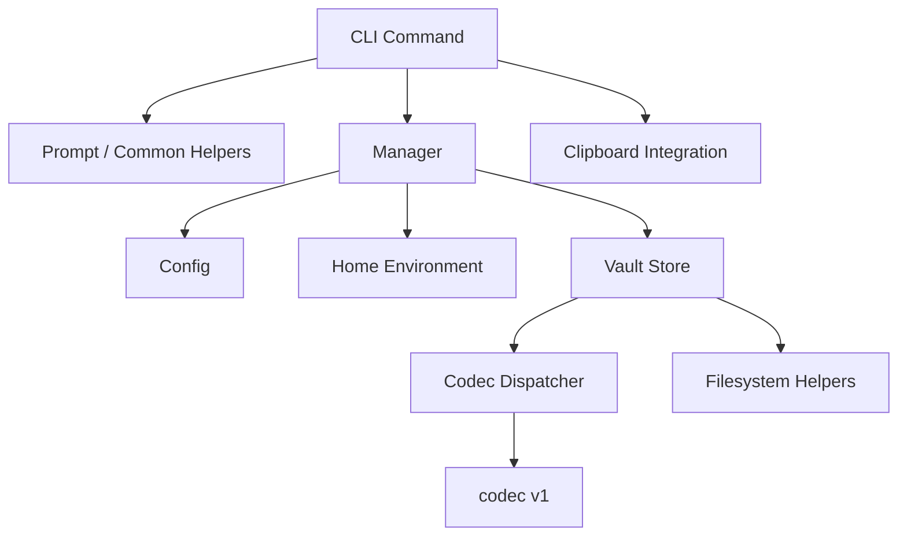

# keepass 1.0.0 Overall Design

## Status

- Version baseline: `1.0.0`
- Document purpose: describe the product, architecture, storage model, security model, CLI behavior, quality gates, and known boundaries of the 1.0.0 release line
- Scope: local-first single-user CLI password manager

## Companion Documents

- [Architecture](./architecture-v1.0.0.md)
- [Storage and Security Design](./storage-security-v1.0.0.md)
- [CLI Specification](./cli-spec-v1.0.0.md)
- [Operations Guide](./operations-v1.0.0.md)

## Contents

- [1. Goals](#1-goals)
- [2. Product Scope](#2-product-scope)
- [3. Non-goals](#3-non-goals)
- [4. Architecture Overview](#4-architecture-overview)
- [5. Component Responsibilities](#5-component-responsibilities)
- [6. Runtime Paths](#6-runtime-paths)
- [7. Data Model](#7-data-model)
- [8. Vault File Format](#8-vault-file-format)
- [9. Security Design](#9-security-design)
- [10. CLI Interaction Design](#10-cli-interaction-design)
- [11. Lookup and Filtering Semantics](#11-lookup-and-filtering-semantics)
- [12. Output Design](#12-output-design)
- [13. Error and Exit Code Design](#13-error-and-exit-code-design)
- [14. Versioning and Build Metadata](#14-versioning-and-build-metadata)
- [15. Quality and Test Strategy](#15-quality-and-test-strategy)
- [16. CI and Release Design](#16-ci-and-release-design)
- [17. Operational Constraints](#17-operational-constraints)
- [18. Known Limitations](#18-known-limitations)
- [19. Evolution Direction After 1.0.0](#19-evolution-direction-after-100)
- [20. Summary](#20-summary)
- [21. Glossary](#21-glossary)

## 1. Goals

The 1.0.0 design is built around three primary goals:

1. Security first
2. Low-friction CLI usage
3. Fast and predictable entry lookup

In practice, this means:

- one master password unlocks the whole vault
- secrets are encrypted at rest
- commands are short and scriptable
- default behavior is safe
- lookup behavior is deterministic

### 1.1 Design Invariants

The following invariants are expected to remain true throughout the 1.0.0 line:

- the vault format is versioned and unknown versions fail closed
- the config file must not store secrets
- aliases are unique after normalization
- password disclosure requires explicit user intent
- filesystem writes for vault and config are atomic
- machine-readable output must be stable enough for shell automation

## 2. Product Scope

The 1.0.0 release supports:

- local vault initialization
- add, get, list, update, delete, and rehash operations for password entries and vault maintenance
- exact alias lookup and unique-prefix lookup
- human-readable and JSON output modes
- shell completion generation
- clipboard copy for password retrieval
- non-interactive behavior for automation
- versioned vault format

Each entry can store:

- `alias`
- `username`
- `password`
- `uri`
- `note`
- `tags`

## 3. Non-goals

The 1.0.0 design explicitly does not target:

- cloud sync
- multi-user collaboration
- remote secret storage
- TOTP or MFA token management
- attachments or binary blobs
- record-level partial unlock
- hardware-backed key management
- background daemon services

## 4. Architecture Overview

The codebase follows a small layered architecture:

```text
CLI commands (cobra)
  -> common utilities / prompt / output formatting / clipboard integration
  -> manager service layer
  -> config + environment resolution
  -> vault storage + crypto codec
  -> filesystem helpers
```

The main runtime dependency flow is:



More concretely:

- `main.go`
  - program entrypoint
- `cmd/cmder/...`
  - CLI command definitions and user-facing behavior
- `internal/manager`
  - core business rules for entry CRUD, alias resolution, filtering, and normalization
- `configs`
  - config defaults, load/save, validation, resolved vault path
- `internal/vault`
  - vault document model, format versioning, encoding/decoding, encrypted persistence
- `internal/home`
  - runtime home directory resolution
- `internal/prompt`
  - interactive terminal input and secret prompts
- `internal/password`
  - secure password generation
- `internal/clipboard`
  - clipboard copy and timed clearing support
- `pkg/files`
  - directory creation and atomic file writes

## 5. Component Responsibilities

### 5.1 CLI Layer

The CLI layer is built on `cobra` and is responsible for:

- command routing
- argument and flag definitions
- interactive prompt orchestration
- human-readable vs JSON output selection
- error-to-exit-code mapping

Root commands in 1.0.0:

- `init`
- `add`
- `list`
- `get`
- `update`
- `delete`
- `audit`
- `rotate`
- `export`
- `import`
- `backup`
- `restore`
- `doctor`
- `rehash`
- `config`
- `completion`

### 5.2 Service Layer

`internal/manager` is the main application service layer.

It owns:

- alias normalization
- tag normalization and deduplication
- unique-prefix matching
- entry sorting
- list filtering
- entry creation/update timestamp management
- password generation fallback

This keeps command handlers thin and avoids pushing business logic into CLI code.

### 5.3 Storage Layer

`internal/vault` owns:

- vault document structure
- encrypted serialization
- format version dispatch
- master password validation through decryption
- atomic persistence

The storage layer intentionally exposes a small API:

- `Initialize`
- `Load`
- `Save`
- `Exists`

### 5.4 Environment and Config Layer

`internal/home` resolves runtime paths.

Resolution order:

1. `KEEPASS_HOME`
2. user home directory + `~/.keepass`

`configs` owns:

- config defaults
- config validation
- config persistence
- vault path resolution

### 5.5 Cross-cutting Responsibilities

Some behaviors intentionally span multiple layers:

- build metadata
  - injected at build time, surfaced by the CLI layer
- exit codes
  - domain errors originate in storage or config layers and are mapped in the CLI common layer
- secure defaults
  - config defaults, manager behavior, and output formatting all participate in reducing accidental exposure

## 6. Runtime Paths

Default runtime layout:

- root dir: `~/.keepass`
- config file: `~/.keepass/keepass.config.json`
- vault file: `~/.keepass/keepass.kp`

When `KEEPASS_HOME` is set:

- root dir becomes the provided directory
- config and vault paths are resolved inside that directory unless config overrides the vault path

## 7. Data Model

### 7.1 Config Model

The config file stores only non-secret operational settings.

Main fields:

- `version`
- `vault.path`
- `vault.format_version`
- `security.argon2id`
- `password_generator`

Password generator configuration supports:

- `default_length`
- `preset`
- optional custom `alphabet` override

Default KDF and generator values:

- Argon2id time: `3`
- Argon2id memory: `262144 KiB`
- Argon2id threads: `4`
- Argon2id key length: `32`
- generated password length: `21`

### 7.2 Vault Model

The decrypted vault payload is a JSON document:

- document version
- created/updated timestamps
- entry list

Each entry contains:

- `alias`
- `username`
- `password`
- `uri`
- `note`
- `tags`
- `created_at`
- `updated_at`
- `password_updated_at`

### 7.3 Entry Naming Rules

Aliases and tags use the same normalization constraints:

- lowercased
- trimmed
- must match: `[a-z0-9][a-z0-9._-]*`

This rule keeps lookup predictable and avoids shell-hostile identifiers.

## 8. Vault File Format

The vault file is versioned and fail-closed.

The outer file structure is:

1. 4-byte magic: `KPAV`
2. 2-byte format version
3. 4-byte header length
4. JSON header
5. authenticated ciphertext

The v1 JSON header contains:

- KDF name
- cipher name
- salt
- nonce
- Argon2id parameters

Design properties:

- unknown versions are rejected
- malformed headers are rejected
- decryption failures do not reveal whether the payload was tampered or the password was wrong beyond an unlock failure signal

## 9. Security Design

### 9.1 Encryption

Vault encryption in v1 uses:

- KDF: `Argon2id`
- AEAD: `XChaCha20-Poly1305`

The process is:

1. derive a key from the master password and random salt
2. generate a random XChaCha nonce
3. encrypt the JSON payload
4. bind the vault header as associated data

Using the header as AEAD associated data protects format metadata against tampering.

### 9.2 File Permissions

The implementation enforces restrictive permissions:

- directory mode: `0700`
- file mode: `0600`

This applies to both config and vault persistence.

### 9.3 Atomic Writes

Vault and config writes use a temporary file in the target directory followed by rename.

This reduces the chance of partially written files after interruption or crash.

### 9.4 Secret Exposure Rules

The 1.0.0 design intentionally limits accidental secret exposure:

- passwords are hidden in default `get` output
- list output never shows passwords
- JSON output suppresses password unless `--reveal` is used
- generated passwords are not printed by default
- clipboard copy does not print plaintext

### 9.5 Remaining Security Boundaries

The 1.0.0 design is secure for a local CLI baseline, but it does not eliminate all exposure surfaces:

- the whole vault is decrypted in process memory during operations
- clipboard copy depends on platform clipboard behavior
- the config file is not encrypted
- there is no secure memory wiping strategy across the whole process

### 9.6 Threat Model Summary

The 1.0.0 design primarily defends against:

- offline disclosure from a stolen vault file
- accidental plaintext leakage through default CLI output
- malformed or unsupported vault format acceptance
- partial write corruption during config or vault persistence

The 1.0.0 design does not fully defend against:

- a fully compromised local user account
- malware reading process memory or intercepting terminal input
- hostile clipboard managers or OS-level clipboard history
- physical attacks against an unlocked session

Trust assumptions:

- the host operating system is broadly trustworthy
- the Go runtime and crypto primitives behave correctly
- the user can protect the master password during input

## 10. CLI Interaction Design

### 10.1 Interaction Modes

The CLI supports two modes:

- interactive
- non-interactive

Interactive mode is used when stdin is a TTY and `--non-interactive` is not set.

Non-interactive mode is designed for:

- scripts
- CI
- pipes

### 10.2 Add Flow

`add` accepts `[alias] [username]`.

Behavior:

- if missing in interactive mode, alias and username are prompted
- if missing in non-interactive mode, the command fails fast
- password can be entered manually or auto-generated
- manual password entry requires confirmation
- master password is always requested before write

### 10.3 Get Flow

`get <alias>` supports:

- hidden default output
- `--reveal`
- `--json`
- `--copy`
- `--copy-timeout`

Clipboard behavior:

- `--copy --copy-timeout 0` copies and returns immediately
- `--copy --copy-timeout N` keeps the process alive until the timeout expires, then clears the clipboard

This is an intentional 1.0.0 behavior because a short-lived process cannot reliably clear the clipboard after exit.

### 10.4 Update Flow

`update <alias>` is interactive-first.

Behavior:

- current values are shown as defaults
- tags can be replaced or cleared
- password action is explicit: keep, manual replace, or generate
- master password is required before update

### 10.5 Delete Flow

`delete <alias>`:

- resolves the target entry first
- confirms deletion by default
- allows skipping confirmation with `--yes`

### 10.6 Rehash Flow

`rehash`:

- unlocks the existing vault
- rewrites it with the current configured Argon2id parameters
- keeps the same master password
- is intended for offline-hardening upgrades after config changes

### 10.7 Doctor Flow

`doctor`:

- performs a non-destructive local audit
- does not require the master password
- reports config presence, vault presence, stored KDF metadata, and rehash recommendations
- supports text and JSON output

### 10.8 Transfer and Recovery Flows

`export` / `import`:

- operate on unlocked logical entry data
- use a versioned JSON transfer format
- require explicit conflict handling for import
- should be treated as plaintext-sensitive workflows

`backup` / `restore`:

- operate on encrypted vault/config state
- use a local backup bundle with manifest metadata
- restore requires explicit overwrite intent when target state already exists

### 10.9 Credential Audit and Rotation

`audit`:

- unlocks the vault
- reports stale passwords, duplicate passwords, and missing metadata
- supports text and JSON output

`rotate`:

- rotates the password for a single alias
- supports generated and manual password replacement
- avoids printing the new password unless explicitly requested

### 10.10 Config and Completion

`config` shows effective resolved configuration.

`completion` generates shell completion scripts for:

- bash
- zsh
- fish
- powershell

### 10.11 Command Contract Matrix

| Command | Read vault | Write vault | Requires master password | Supports JSON | Interactive by default |
| --- | --- | --- | --- | --- | --- |
| `init` | No | Yes | Yes | No | Yes |
| `add` | Yes | Yes | Yes | No | Yes |
| `list` | Yes | No | Yes | Yes | Minimal |
| `get` | Yes | No | Yes | Yes | Minimal |
| `update` | Yes | Yes | Yes | No | Yes |
| `delete` | Yes | Yes | Yes | No | Yes |
| `doctor` | No | No | No | Yes | No |
| `rehash` | Yes | Yes | Yes | No | Minimal |
| `config` | No | No | No | Yes | No |
| `completion` | No | No | No | No | No |

Notes:

- `list` and `get` prompt only for the master password unless special flags are used
- `config` reads local configuration state, but does not unlock the vault
- `completion` is a pure generation command and does not depend on runtime state

## 11. Lookup and Filtering Semantics

Entry lookup uses a strict order:

1. exact alias match
2. unique prefix match
3. ambiguous prefix failure

This design optimizes for speed while still keeping behavior deterministic.

List filtering supports:

- optional query
- repeatable tag filter

Tag filtering is an all-match policy, not any-match.

## 12. Output Design

The CLI supports two output styles:

- human-readable text
- JSON

Text mode is optimized for terminal use.

JSON mode is optimized for:

- scripting
- integration with shell pipelines
- machine-readable automation

JSON intentionally omits or masks sensitive content unless the user explicitly opts in.

## 13. Error and Exit Code Design

The CLI maps selected domain errors to stable exit codes:

- `1`: generic error
- `2`: usage / invalid arguments
- `3`: not initialized
- `4`: unlock failed

Important mapped cases:

- missing config or vault -> `3`
- wrong master password / decrypt failure -> `4`

This supports reliable shell automation.

## 14. Versioning and Build Metadata

The build pipeline injects version metadata through linker flags.

The binary reports:

- version
- commit
- build time

This design avoids drift between:

- release tag
- binary `--version` output
- packaged release artifacts

For local development builds, the default version is `dev`.

### 14.1 Compatibility Strategy

Compatibility in the 1.0.0 line is defined as:

- CLI commands may grow new flags, but existing core flows should remain stable
- exit code meanings should remain stable
- vault format version `1` remains readable and writable
- config version `1` remains valid unless a deliberate version bump is introduced

If a future release needs a new vault format:

1. introduce a new explicit format version
2. keep old-version detection strict
3. avoid silent in-place upgrades without user-visible intent

## 15. Quality and Test Strategy

The 1.0.0 line includes:

- unit tests for config validation
- unit tests for password generation
- vault round-trip and tamper tests
- manager rule tests
- command flow integration tests
- exit code tests
- fuzz entry point for vault decoding
- race-enabled test execution in the quality gate

The quality gate is designed to enforce:

- tidy module state
- formatting
- `go vet`
- race-enabled tests

## 16. CI and Release Design

### 16.1 CI

CI runs on GitHub Actions and focuses on:

- module hygiene
- formatting checks
- static verification
- test execution
- cross-platform build matrix

### 16.2 Release

The release workflow is tag-driven.

Artifacts are built for:

- Linux amd64
- Linux arm64
- macOS amd64
- macOS arm64
- Windows amd64

Each release publishes:

- packaged binaries
- `SHA256SUMS.txt`
- GitHub artifact attestation

This gives 1.0.0 a stronger provenance and integrity story than a binary-only release.

The release workflow also establishes a clean separation between:

- build-time metadata generation
- binary packaging
- checksum generation
- provenance attestation
- GitHub Release publication

## 17. Operational Constraints

The 1.0.0 design assumes:

- one local user context
- local filesystem access
- terminal-based interaction
- no daemon, database, or remote backend

Because the system is local-first, operational simplicity is prioritized over distributed features.

## 18. Known Limitations

The current 1.0.0 design has several intentional limits:

- no multi-vault profile system
- no sync or replication
- no audit log
- no secret sharing
- no attachment encryption
- no password history
- no structured search indexing beyond linear scan and prefix lookup
- no per-entry access control

These constraints keep 1.0.0 small, understandable, and easy to verify.

## 19. Evolution Direction After 1.0.0

Natural next steps after the 1.0.0 baseline include:

- richer structured query and filtering
- password history or rotation metadata
- stronger release hardening such as signature verification flows
- more formal lint configuration
- import/export tooling
- optional multi-vault support
- future vault format revisions behind explicit format version upgrades

## 20. Summary

The 1.0.0 design intentionally favors:

- small surface area
- explicit control flow
- encrypted local persistence
- deterministic lookup behavior
- automation-friendly CLI semantics
- auditable build and release mechanics

It is not a full secret platform.

It is a focused, local-first, versioned, encrypted password manager CLI with a clear path for controlled evolution.

## 21. Glossary

- AEAD
  - Authenticated encryption with associated data
- Argon2id
  - password-based key derivation function used to derive the vault key
- Associated data
  - authenticated but unencrypted metadata bound to ciphertext integrity
- Fail closed
  - reject unknown or invalid states instead of accepting them leniently
- Format version
  - on-disk vault encoding version used by the codec dispatcher
- KDF
  - key derivation function
- Local-first
  - all primary data operations happen on the local machine without a required remote service
- Unique-prefix lookup
  - alias resolution rule that accepts a prefix only when exactly one entry matches
