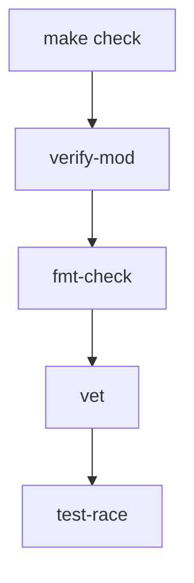
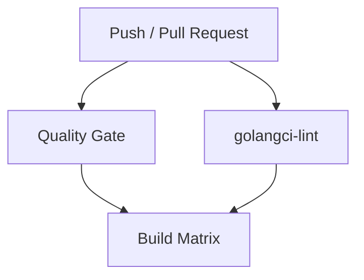
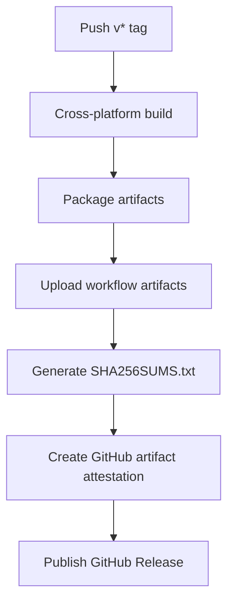
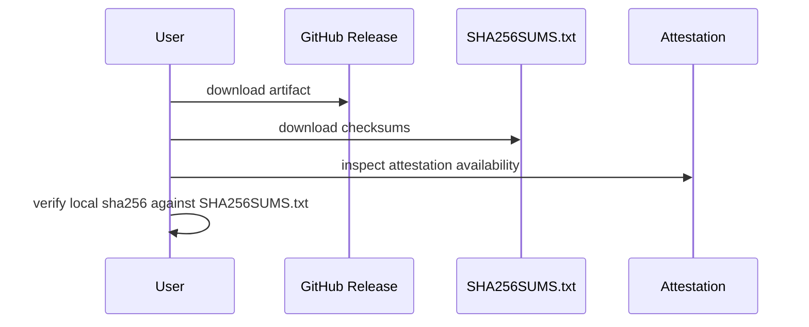

# keepass 1.0.0 Operations Guide

## Scope

This document covers the engineering and operational workflow around the `keepass` 1.0.0 code line:

- local development workflow
- quality gate execution
- build metadata injection
- CI and release operations
- release artifact verification

For high-level design, see [keepass-v1.0.0-design.md](./keepass-v1.0.0-design.md).

## 1. Local Developer Workflow

The main local entrypoint is the `Makefile`.

Core targets:

- `make deps`
- `make tidy`
- `make fmt`
- `make fmt-check`
- `make vet`
- `make test`
- `make test-race`
- `make check`
- `make build`

Design goals of the local workflow:

- no dependence on the user home Go cache
- stable build metadata injection
- a single quality gate that mirrors CI behavior closely

When local security parameters are increased, the expected operational follow-up is:

```bash
keepass rehash
```

This rewrites the vault with the current configured Argon2 settings.

## 2. Local Quality Gate

The recommended local verification target is:

```bash
make check
```

It currently covers:

- module tidy verification
- formatting verification
- `go vet`
- race-enabled tests with coverage output

Execution order:



This is the closest local equivalent to the CI quality gate.

## 3. Build Metadata Injection

Builds inject:

- `VERSION`
- `COMMIT`
- `BUILD_TIME`

Example:

```bash
make build VERSION=v1.0.0 COMMIT=$(git rev-parse --short HEAD) BUILD_TIME=$(date -u +%Y-%m-%dT%H:%M:%SZ)
```

This metadata is surfaced by:

```bash
./keepass --version
```

## 4. Build Targets

The project supports:

- default host build
- Linux amd64 build
- Windows amd64 build
- macOS amd64 build

Cross-platform release builds are driven through CI using environment variables and linker flags.

## 5. CI Pipeline

The CI workflow has three main concerns:

- quality gate
- lint
- cross-platform build matrix

Logical CI flow:



The quality gate runs:

- module verification
- formatting verification
- `go vet`
- race-enabled tests

## 6. Release Pipeline

Releases are tag-driven and generate versioned artifacts with provenance metadata.

Release flow:



Artifact families:

- `.tar.gz` for Unix-like targets
- `.zip` for Windows targets
- `SHA256SUMS.txt`
- attestation bundle

## 7. Release Integrity Verification

Consumers of a release should verify at least:

- checksum file presence
- artifact checksum match
- provenance attestation availability

Recommended verification model:



This does not replace host trust, but it improves release-chain transparency.

## 8. Operational Caveats

### 8.1 Dirty Working Tree and `verify-mod`

`verify-mod` is designed to detect whether `go mod tidy` would introduce effective changes.

It compares pre- and post-tidy module files while restoring the originals, which makes it safer to run in a working tree with unrelated local changes.

### 8.2 Clipboard Operations

Clipboard-based retrieval is operationally convenient but should not be treated as a durable secure transport.

### 8.3 Local Cache Directories

The project prefers repository-local or explicitly provided cache directories for deterministic CI-like behavior.

This avoids hidden dependence on:

- user-specific global cache paths
- restricted home-directory cache locations

## 9. Recommended Operator Checklist

Before opening a PR:

1. Run `make check`
2. Run `make build`
3. Run `keepass doctor` against a representative local environment when maintenance or security behavior changed
4. Verify `./keepass --version` if metadata-sensitive changes were made
5. Review documentation updates for behavior changes

For automation-sensitive CLI changes, also verify:

- non-interactive update paths fail fast without mutation intent
- non-interactive delete paths require `--yes`
- built-binary exit codes still match documented usage behavior

For transfer and recovery changes, also verify:

- export output is treated as plaintext-sensitive data
- import conflict strategy is explicit and tested
- backup bundles contain config, vault, and manifest metadata
- restore behavior is explicit about overwrite semantics

Before publishing a release:

1. Ensure the tag is correct
2. Ensure release metadata injection uses the intended tag and commit
3. Confirm checksum generation succeeds
4. Confirm attestation generation succeeds
5. Confirm published assets match the target matrix

## 10. Summary

The 1.0.0 operations model is intentionally simple:

- one local quality gate
- one release pipeline
- one build metadata contract
- one integrity verification path

This keeps day-to-day engineering predictable while still giving releases a credible provenance story.
