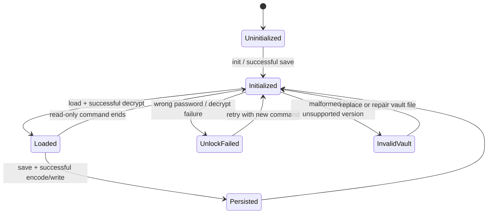
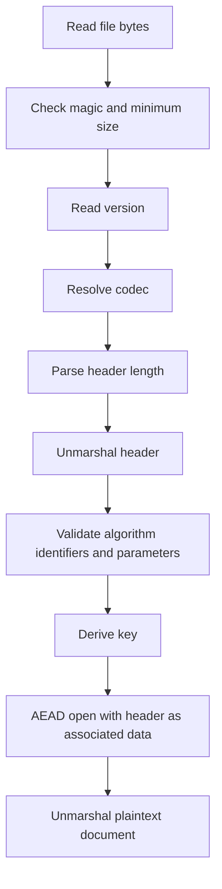
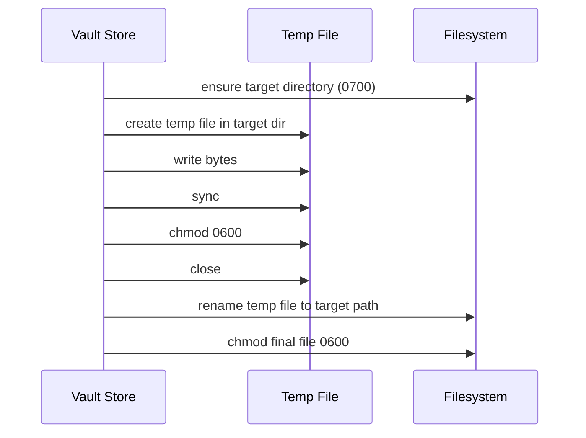

# keepass 1.0.0 Storage and Security Design

## Scope

This document focuses on the storage, cryptography, integrity, and trust boundaries of `keepass` 1.0.0.

For system structure, see [architecture-v1.0.0.md](./architecture-v1.0.0.md).

For command contracts, see [cli-spec-v1.0.0.md](./cli-spec-v1.0.0.md).

## 1. Design Goals

The storage and security model aims to provide:

- encrypted local persistence
- fail-closed parsing
- explicit format versioning
- low operational complexity
- predictable recovery behavior

## 2. Runtime Files

The 1.0.0 line uses two main local files:

- config file
- vault file

Default locations:

- config: `~/.keepass/keepass.config.json`
- vault: `~/.keepass/keepass.kp`

The config file is plain JSON and stores non-secret operational settings.

The vault file is encrypted and stores all entry secrets.

## 3. Config Design

### 3.1 Purpose

The config file exists to hold:

- storage paths
- vault format choice
- Argon2id parameters
- password generation defaults and preset selection

It intentionally does not store:

- the master password
- any account password
- derived encryption keys

### 3.2 Validation Rules

Version 1 config validation enforces:

- config version must be supported
- vault format version must be positive
- vault path must be non-empty
- Argon2id parameters must be above minimum thresholds
- password generator length must be positive
- password alphabet must be non-empty

This prevents accepting obviously unsafe or incomplete local state.

### 3.3 Default Parameters

Default security parameters:

- Argon2id time: `3`
- Argon2id memory: `262144 KiB`
- Argon2id threads: `4`
- Argon2id key length: `32`

Default password generation parameters:

- length: `21`
- preset: `compatible`

Supported built-in presets:

- `compatible`
- `symbols`
- `strict-high-entropy`

## 4. Vault Data Model

The decrypted vault document is JSON and contains:

- document version
- document timestamps
- entry list

Each entry contains:

- alias
- username
- password
- uri
- note
- tags
- created timestamp
- updated timestamp
- password-updated timestamp

Design tradeoff:

- JSON keeps the decrypted logical format easy to inspect in tests
- encryption is handled at the file boundary instead of on individual fields

## 5. On-Disk Vault Format

The vault file is not plain JSON.

It uses a versioned binary container:

1. file magic
2. format version
3. header length
4. JSON header
5. ciphertext

Magic value:

- `KPAV`

Version strategy:

- decoding first detects the version
- unknown versions are rejected
- version-specific codecs are selected explicitly

This avoids silent parsing drift.

## 6. Version 1 Crypto Format

### 6.1 Algorithms

Version 1 uses:

- KDF: `Argon2id`
- AEAD: `XChaCha20-Poly1305`

### 6.2 Header Contents

The v1 header stores:

- KDF identifier
- cipher identifier
- salt
- nonce
- Argon2id parameters

This header is JSON and included as AEAD associated data.

### 6.3 Vault State Model

At the storage boundary, the vault moves through a small number of well-defined states:

Design implication:

- the runtime never treats malformed state as partially acceptable
- invalid format and unlock failure are separate operational outcomes
- successful mutation always returns to an encrypted-at-rest state

### 6.4 Encode Flow

Encode flow:

1. generate random salt
2. generate random nonce
3. derive a key from master password + salt
4. marshal header JSON
5. encrypt plaintext document with header as associated data
6. assemble final file bytes

### 6.5 Decode Flow

Decode flow:

1. verify magic and minimum size
2. extract format version
3. parse header length and header payload
4. validate header values
5. derive the decryption key
6. attempt AEAD open
7. unmarshal plaintext JSON document

## 7. Integrity Design

Integrity is enforced at multiple levels:

- header structure validation
- explicit supported algorithm identifiers
- AEAD authentication of the ciphertext
- AEAD binding of the header as associated data
- strict rejection of malformed sizes or unsupported versions

This means:

- tampered ciphertext fails authentication
- tampered authenticated header data fails authentication
- structurally invalid files fail before decryption

### 7.1 Integrity Verification Layers

The implementation effectively applies integrity checks in this order:

Failure at any stage aborts the load path.

## 8. Filesystem Safety

### 8.1 Directory and File Modes

The implementation uses restrictive modes:

- directories: `0700`
- files: `0600`

### 8.2 Atomic Persistence

Config and vault writes are done through:

1. create temp file in target directory
2. write bytes
3. sync file
4. chmod file
5. close file
6. rename into place
7. re-apply final mode

This minimizes risk from interrupted writes.

### 8.3 Why Atomic Writes Matter

Without atomic persistence, a crash could leave:

- truncated config JSON
- half-written ciphertext
- broken vault headers

The current design avoids this class of corruption as much as possible with local filesystem semantics.

### 8.4 Persistence Sequence

This sequence is intentionally local and synchronous.

## 9. Rehash Operation

The 1.0.0 line supports a vault `rehash` maintenance operation.

Purpose:

- re-encrypt the existing vault with the current configured Argon2id parameters
- keep the same master password
- refresh salt and nonce through a normal save path

Operationally, this is the upgrade path after strengthening local Argon2 settings.

## 10. Secret Exposure Design

The 1.0.0 line tries to reduce accidental disclosure through CLI behavior:

- `list` never prints passwords
- `get` hides passwords unless `--reveal` is used
- JSON output clears password unless reveal is explicit
- generated passwords are not shown by default
- clipboard copy does not print plaintext

These are usability-aware controls, not full secret-isolation guarantees.

## 11. Clipboard Security Boundary

Clipboard copy is intentionally treated as a convenience feature with explicit tradeoffs.

Properties:

- copy is opt-in
- plaintext is not echoed when copying
- timeout-based clearing is supported
- timeout clearing is performed while the process remains alive

Limitations:

- the OS may preserve clipboard history
- third-party clipboard tools may capture values
- once copied, the secret is outside vault storage guarantees

## 12. Threat Model

### 12.1 Primary Defenses

The 1.0.0 design primarily defends against:

- offline disclosure from a stolen encrypted vault file
- accidental exposure in default CLI output
- malformed or corrupted vault file acceptance
- unsupported format acceptance

### 12.2 Out-of-scope Threats

The 1.0.0 design does not fully address:

- host compromise
- keyloggers
- malware reading process memory
- clipboard surveillance
- screen capture
- physical attacks against an unlocked machine

### 12.3 Trust Assumptions

The design assumes:

- the operating system is broadly trustworthy
- local file permissions have meaning on the host
- the user can protect the master password during entry
- the Go crypto and runtime stack are trustworthy dependencies

## 13. Failure Model

Important failure outcomes:

- missing config or vault
  - treated as not initialized
- wrong master password
  - treated as unlock failure
- invalid file structure
  - treated as invalid vault file
- unsupported vault version
  - treated as unsupported version

The goal is to keep failures explicit and deterministic.

## 14. Compatibility and Upgrade Strategy

The 1.0.0 line keeps:

- config version `1`
- vault format version `1`

Compatibility policy:

- read/write support for v1 remains stable
- future incompatible changes must use explicit new versions
- parsing remains fail-closed for unknown versions
- silent upgrade behavior should be avoided

This is especially important for encrypted local storage because hidden upgrades make rollback and audit harder.

## 15. Security Testing Strategy

Security-relevant testing in the 1.0.0 code line includes:

- round-trip encode/decode tests
- wrong-password rejection tests
- tampered ciphertext rejection tests
- unsupported version rejection tests
- malformed header rejection tests
- fuzz input for decode

These tests do not prove total security, but they do cover the main correctness boundaries of the vault design.

## 16. Residual Risks

Residual risks in 1.0.0 include:

- in-memory plaintext lifetime during command execution
- clipboard escape from vault guarantees
- no hardware-rooted secret protection
- no secret shredding guarantees after process use
- local compromise defeats the model

These are acceptable for a focused local-first CLI baseline, but should stay visible in future design discussions.

## 17. Summary

The 1.0.0 storage and security design is intentionally conservative:

- a plain config file for non-secret settings
- a versioned encrypted vault file for secrets
- Argon2id + XChaCha20-Poly1305 for core crypto
- strict format validation
- atomic local persistence
- explicit trust boundaries

It provides a strong baseline for a local CLI password manager without pretending to solve host-compromise problems.
